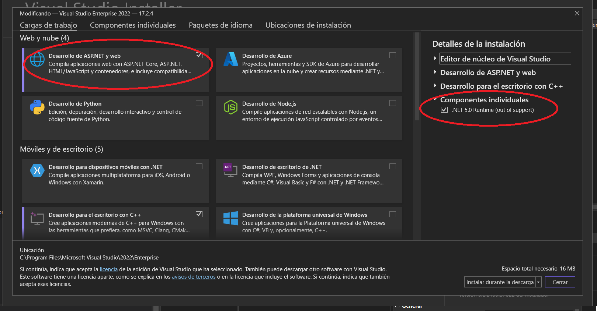
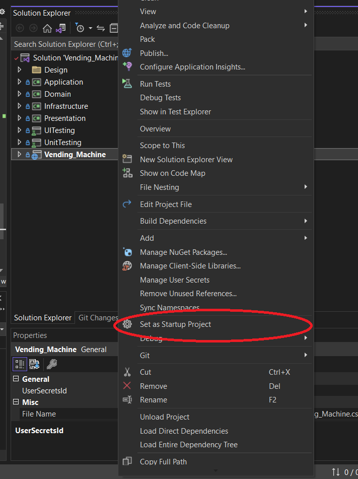
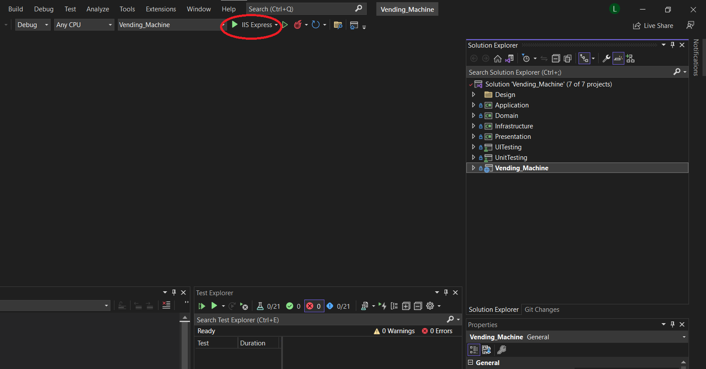

# # Vending_Machine
The goal of this application is to demonstrate the practical use of **clean code** design rules and patterns, such as the **template method**, and the use of a **clean architecture** based on **DomainDrivenDesign**, to generate maintainable code.
Transversely, **unit tests** and **UI tests** are implemented in the project.
> Design details can be found in the Design folder

## execution instructions
1) Clone the repository locally, using Visual Studio

2) Make sure you have .net 5.0 installed and ASP.net web development

3) Right click on the Vending_Machine project and select it as the start project

4) Click on the button to run using ISSExpress

